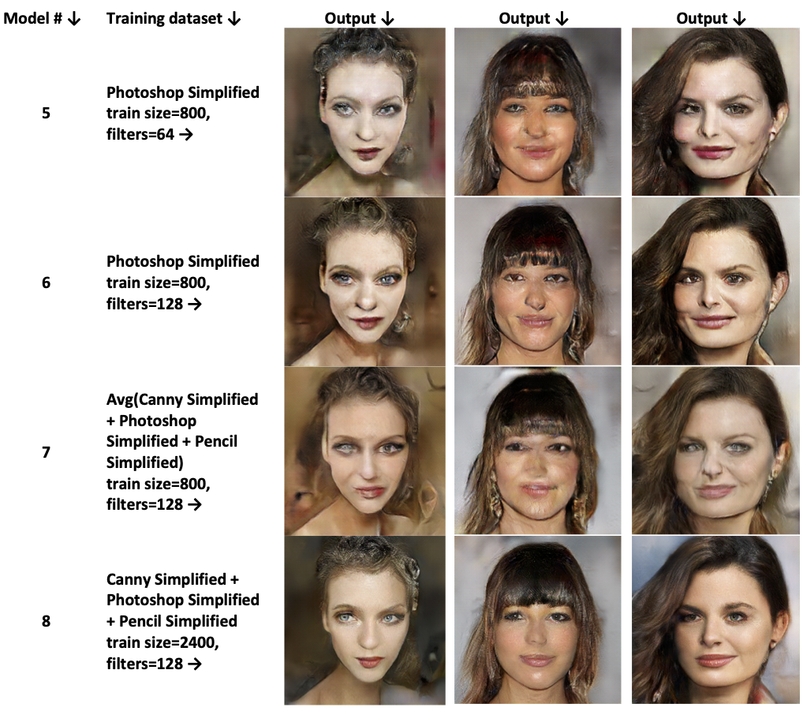

# Generating High Quality Facial Images from Sketches Using Conditional GANs
[Final Report](final_report.pdf)

Using conditional GAN model [pix2pix](https://github.com/phillipi/pix2pix) (Image-to-image translation with conditional adversarial nets), we have investigated the effect of the variation of simple input sketches to the output facial images. 

We adopted three ways of sketch generation: Canny edge detection, a Photoshop filter, and a sketching scheme based on a fully-convolutional network. Additionally, we also applied a simplification scheme similarly based on a fully-convolutional network to generate a mixture of both high and low-quality sketches. 

Exploring various schemes for data augmentation, we found that we were able to generate the highest-quality images when training using a augmented dataset containing simplified sketches from all three generation algorithms. The current shortcomings of our method, such as inability to deal with artifacts in sketches and bias in determining color present interesting future directions for this work.

result1             |  result2
:-------------------------:|:-------------------------:
  |  
